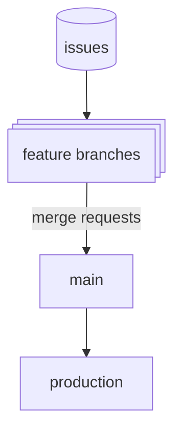
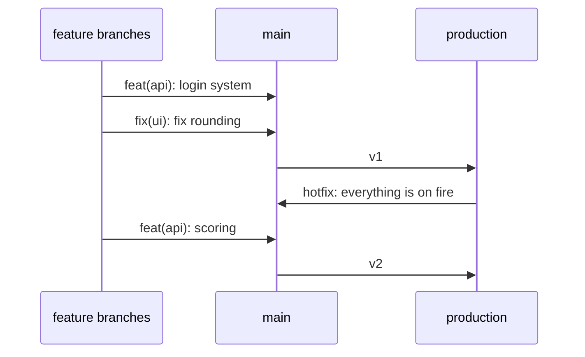

# Merge requests

- Must have at least 1 approval
- Creator of merge request can approve it's own merge request, **this is reserved for only trivial changes**
- Needs to have a reference to an issue (closes, refs, ...)

# Commit message guidelines

`type(scope): message`

*If it's the only commit: (this will automatically be added to MR)*

`<empty line>`

`[Keyword] #issue`

## 1. Allowed Types
| Type | Purpose | Example |
| :--- | :--- | :--- |
| **feat** | New feature or capability | `feat(api): add auth endpoint` |
| **fix** | Bug fix | `fix(ui): resolve layout shift` |
| **refactor** | Code restructuring (no new features/fixes) | `refactor(api): extract query logic` |
| **chore** | Routine maintenance, config, tools | `chore: update .gitignore` |
| **docs** | Documentation and notes | `docs(notes): add project roadmap` |
| **ci** | CI/CD pipelines, dev environments | `ci: update build runner` |

## 2. Monorepo Scopes
| Scope | Area | Example |
| :--- | :--- | :--- |
| **(api)** | Backend logic, servers, APIs | `feat(api): create user endpoint` |
| **(ui)** | Frontend, client, components | `fix(ui): align header logo` |
| **(db)** | Database schemas, migrations | `chore(db): add user table` |
| **(ci)** | GitLab CI, NixOS configs, pipelines | `fix(ci): update flake.nix` |
| **(docs)** | Technical docs, architecture | `docs: update setup guide` |
| **(notes)** | Meetings, planning | `docs(notes): update milestones` |

## 3. GitLab Issue Linking
| Keyword | Action | When to use |
| :--- | :--- | :--- |
| **Refs: #123** | Links commit to issue (keeps it open) | In **every commit message** on your feature branch. |
| **Closes #123** | Closes the issue when merged to main | In the **Merge Request description**. |

# Gitlab flow

We'll follow standard gitlab flow + issue first. Meaning that it always starts with an issue, at least *most* of everything should (exception can be for example - meeting notes, smaller doc changes). 
Every feature or fix is in it's own branch. Docs for example again excluded.

For those that need a recap on how that looks in practice:

Feature branches, just like in IDO, will be in the style of `feature/name-of-branch` and for example `fix/name-of-branch`.
